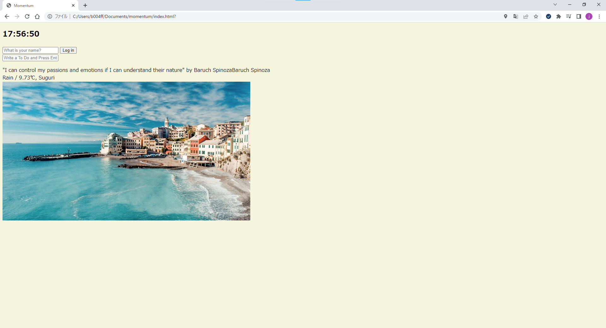
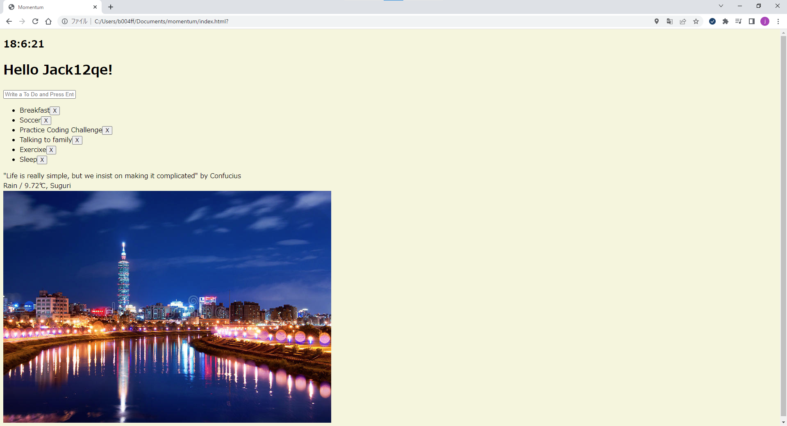

# ToDoListApp.v1

This is my first ToDoList application using HTML, CSS, JavaScript.

Before Login

After Login

The top of app is **time** module which shows one by user's location.  
User can **login** this page with just user's name.  
User also can type **todo list** and which is saved in local storage,  
so this data is existed even if user will exit browser.

This app present **popular saying** to user randomly with interval of 7s,  
**wheater**, **temparature** and **location**, which is all by user's location.
